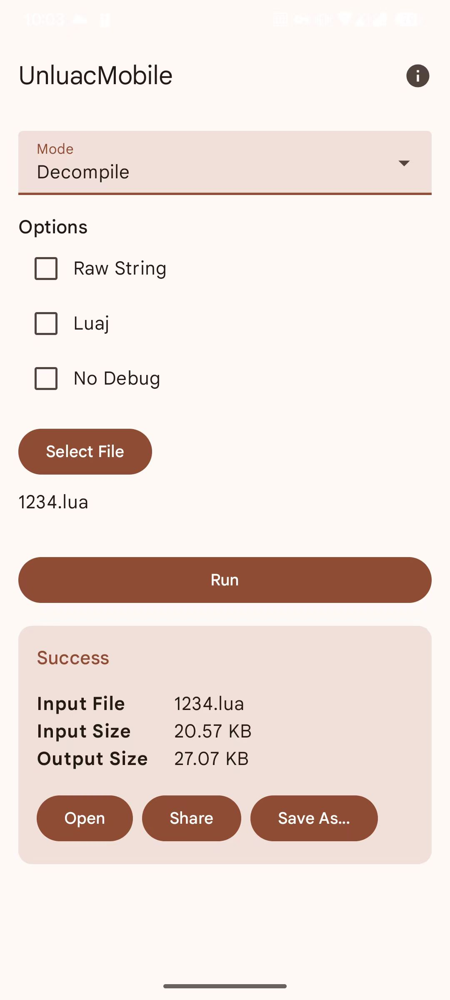

# UnluacMobile

An unofficial Android front-end for the popular `unluac` decompiler.

This application allows you to decompile, disassemble, and assemble Lua scripts directly on your Android device, providing a convenient mobile solution for developers and reverse engineers.

This project is not affiliated with the official unluac project. For the original command-line tool, please visit the official website:

**Official unluac project:** [https://sourceforge.net/projects/unluac/](https://sourceforge.net/projects/unluac/)

## Features

- **Multiple Modes:** Supports decompile, disassemble, and assemble modes.
- **File Handling:** Easy-to-use file picker for input and a "Save As..." dialog for output.
- **Decompiler Options:** Includes common options like `--rawstring`, `--luaj`, and `--nodebug`.
- **Detailed Results:** Shows input and output file sizes upon success.
- **Modern UI:** Built with Jetpack Compose, following Material Design guidelines.
- **Internationalization:** Supports English and Simplified Chinese.

## Screenshots

## License

This project is licensed under the GNU General Public License v3.0. See the [LICENSE](LICENSE) file for details.
